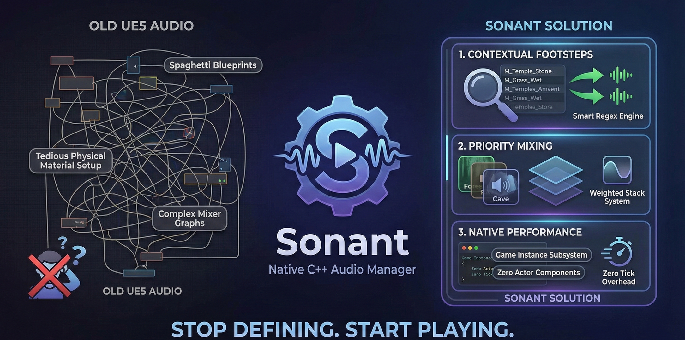
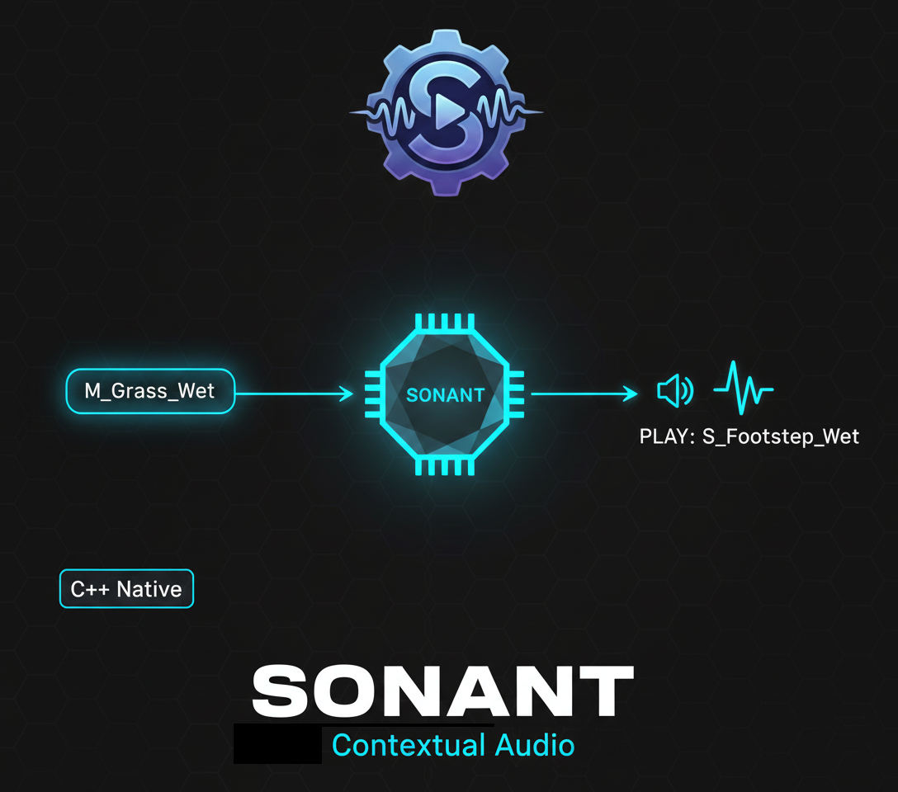

# 🔊 Sonant

> **Native Contextual Audio Middleware for Unreal Engine 5.7**

[](https://gregorigin.com)
[](https://www.unrealengine.com)
[](LICENSE)
[]()

<p align="center">

</p>

Sonant replaces scattered audio logic with a unified, data-driven pipeline. From physically accurate footsteps to dynamic room estimation, Sonant handles the complexity so you can focus on the soundscape.

[📚 Documentation](Resources/Docs/Sonant_1.0_Manual.html) • [🎮 Demo Guide](Resources/Docs/QuickStart_Demo.md) • [🌐 Website](https://www.gregorigin.com)

---

## ✨ Features

### 🎯 Contextual Surfaces
- **Automatic surface detection** via material names, physical materials, or per-face collision
- **GameplayTag-driven events** - Define any audio event (Walk, Run, Land, Impact)
- **Smart caching** - O(1) material lookup after first hit
- **Sub-mesh support** - Different sounds for different parts of complex meshes

### 💥 Physics Impact System
- **Automatic intensity detection** based on impact force
- **Light/Medium/Heavy** categorization with configurable thresholds
- **Pitch and volume scaling** based on physics properties
- **Micro-collision filtering** - Eliminates jitter noise

### 🌊 Auto Reverb Estimation
- **6-direction raycasting** (Up/Down/Left/Right/Forward/Back)
- **Room size calculation** with configurable presets
- **Dynamic Control Bus Mix** activation
- **2Hz update rate** for optimal performance

### 🏔️ Atmosphere Zones
- **Priority-based mixing** - Higher priority zones override lower ones
- **Reference counting** - Proper handling of nested zones
- **Smooth transitions** via AudioModulation
- **Volume component** for easy zone setup

---

<p align="center">

</p>

## 🚀 Quick Start

### Prerequisites
- Unreal Engine 5.7+
- AudioModulation plugin enabled

### Installation

```bash
# Clone or download into your project's Plugins folder
cd YourProject/Plugins
git clone https://github.com/gregorigin/sonant.git Sonant
```

Or manually:
1. Download the latest release
2. Copy `Sonant` folder to `YourProject/Plugins/`
3. Restart Unreal Editor

### Basic Setup

**1. Create Configuration Asset**
```
Content Browser → Right Click → Miscellaneous → Data Asset → SonantConfig
Name: DA_Sonant_Config
```

**2. Configure Surfaces**

| Surface | Keyword | Sound Event |
|---------|---------|-------------|
| 🌱 Grass | `Grass` | `Sonant.Event.Footstep` |
| 🔩 Metal | `Metal` | `Sonant.Event.Footstep` |
| 🪨 Stone | `Stone` | `Sonant.Event.Footstep` |
| 🪵 Wood | `Wood` | `Sonant.Event.Footstep` |
| 🪟 Glass | `Glass` | `Sonant.Event.Footstep` |

**3. Register in Project Settings**
```
Edit → Project Settings → Plugins → Sonant Audio
Main Config: DA_Sonant_Config
```

**4. Add Required GameplayTags**
```
Project Settings → GameplayTags:
- Sonant.Event.Footstep
- Sonant.Event.Impact.Light
- Sonant.Event.Impact.Heavy
- Sonant.Atmosphere.Outdoor
- Sonant.Atmosphere.Cave
- Sonant.Atmosphere.Underwater
```

That's it! You're ready to use Sonant.

---

## 💻 Usage

### Blueprint Example: Footsteps

```
[Animation Notify: Footstep]
    │
    ├── Line Trace by Channel
    │   Start: Foot Socket Location
    │   End: Start + (0, 0, -50)
    │
    └── If Hit
        └── Get Game Instance
            └── Get Subsystem (Sonant Subsystem)
                └── Play Footstep
                    Location: Hit.Location
                    Surface Hit: Hit Result
```

### Blueprint Example: Physics Impact

```
[On Component Hit]
    │
    └── Get Game Instance
        └── Get Subsystem (Sonant Subsystem)
            └── Play Impact
                Location: Hit.Location
                Impact Force: Normal Impulse → Vector Length
                Surface Hit: Hit Result
```

### C++ Example

```cpp
#include "SonantSubsystem.h"

// Get the subsystem
USonantSubsystem* Sonant = GetGameInstance()->GetSubsystem<USonantSubsystem>();

// Play a footstep
FHitResult Hit = /* your line trace result */;
Sonant->PlayFootstep(Hit.ImpactPoint, Hit);

// Play a custom event
Sonant->PlaySoundAtLocation(
    FGameplayTag::RequestGameplayTag("Sonant.Event.Land"),
    Hit.ImpactPoint,
    Hit,
    1.0f, // Volume
    1.0f  // Pitch
);

// Activate an atmosphere zone
Sonant->PushAtmosphere(
    FGameplayTag::RequestGameplayTag("Sonant.Atmosphere.Underwater")
);

// Leave atmosphere zone
Sonant->PopAtmosphere(
    FGameplayTag::RequestGameplayTag("Sonant.Atmosphere.Underwater")
);
```

---

## 🎮 Included Demo

Sonant comes with a comprehensive demo system that showcases all features **without requiring custom audio assets**.

### Demo Features

| Component | Description |
|-----------|-------------|
| **Surface Showcase** | 5 platform types with automatic detection |
| **Impact Range** | Light/Medium/Heavy physics demonstrations |
| **Atmosphere Zones** | Outdoor, Cave, Underwater transitions |
| **Reverb Rooms** | 4 rooms demonstrating auto-reverb (Closet to Cavern) |

### Running the Demo

```cpp
1. Drag ASonantFeatureDemo into your level
2. Set PlatformMesh = /Engine/BasicShapes/Cube
3. Set BaseMaterial = /Engine/BasicShapes/BasicShapeMaterial
4. Press Play!
```

**Controls:**
- `1-5` - Test specific surface types
- `Q` - Light impact test
- `E` - Heavy impact test
- `R` - Cycle through surfaces
- `T` - Debug info

See [Demo Setup Guide](Resources/Docs/QuickStart_Demo.md) for complete instructions.

---

## 🏗️ Architecture

```
┌─────────────────────────────────────────────────────────────┐
│                      Sonant Subsystem                        │
│                   (GameInstanceSubsystem)                    │
└────────────────────┬────────────────────────────────────────┘
                     │
         ┌──────────┼──────────┐
         ▼          ▼          ▼
┌─────────────┐ ┌────────┐ ┌──────────┐
│Surface System│ │Physics │ │Atmosphere│
│             │ │Impact  │ │  Zones   │
├─────────────┤ ├────────┤ ├──────────┤
│• Keyword Map│ │• Force │ │• Priority│
│• Physics Map│ │• Scale │ │• Stack   │
│• Smart Cache│ │• Tags  │ │• Mix     │
└─────────────┘ └────────┘ └──────────┘
         │          │          │
         └──────────┼──────────┘
                    ▼
┌─────────────────────────────────┐
│      AudioModulation System     │
│   (Sound Control Bus Mixes)     │
└─────────────────────────────────┘
```

---

## 📊 Performance

| Feature | Cost | Optimization |
|---------|------|--------------|
| Material Resolution | O(1) after cache | Smart caching with 128-entry reserve |
| Auto Reverb | 6 traces @ 2Hz | Only on Visibility channel |
| Atmosphere Updates | Event-driven | Reference counting |
| Memory | ~50KB base | Scales with surface types |

**Recommended Settings:**
- Reverb Update Rate: 0.5s (2Hz)
- Max Trace Distance: 5000 units
- Cache Pre-allocation: 128 entries

---

## 🛠️ System Requirements

| Requirement | Minimum | Recommended |
|-------------|---------|-------------|
| **Engine** | UE 5.7 | UE 5.7+ |
| **Platform** | Win64, Mac, Linux | Win64 |
| **Dependencies** | AudioModulation, GameplayTags | AudioModulation, GameplayTags |
| **Compiler** | C++20 Support | MSVC 2022 / Clang 14+ |

---

## 📁 Project Structure

```
Sonant/
├── Source/Sonant/
│   ├── Public/
│   │   ├── SonantConfig.h          # Data Asset configuration
│   │   ├── SonantSettings.h        # Project settings
│   │   ├── SonantSubsystem.h       # Main API
│   │   ├── SonantVolume.h          # Atmosphere volume component
│   │   ├── SonantFeatureDemo.h     # Demo environment
│   │   └── SonantDemoCharacter.h   # Demo player character
│   └── Private/
│       ├── Sonant.cpp              # Module implementation
│       ├── SonantSubsystem.cpp     # Core logic
│       ├── SonantFeatureDemo.cpp   # Demo implementation
│       └── ...
├── Resources/
│   ├── Docs/
│   │   ├── Sonant_1.0_Manual.html  # Full documentation
│   │   ├── QuickStart_Demo.md      # Demo quick start
│   │   ├── DemoSetupGuide.md       # Complete setup
│   │   └── DemoREADME.md           # Demo reference
│   └── DemoInput.ini               # Demo input bindings
└── Sonant.uplugin
```

---

## 📚 Documentation

| Document | Description |
|----------|-------------|
| [Full Manual](Resources/Docs/Sonant_1.0_Manual.html) | Complete feature documentation |
| [Quick Start](Resources/Docs/QuickStart_Demo.md) | 5-minute setup guide |
| [Demo Guide](Resources/Docs/DemoSetupGuide.md) | Comprehensive demo setup |
| [API Reference](Resources/Docs/Sonant_1.0_Manual.html#api) | C++ API documentation |

---

## 🎯 Use Cases

- **First-Person Shooters** - Realistic footstep audio on varied terrain
- **Platformers** - Impact sounds for landing and collisions
- **Open World Games** - Dynamic reverb in caves, buildings, and forests
- **Survival Games** - Material-based crafting and building audio
- **VR Experiences** - Spatial audio with environmental effects

---

## 🤝 Support

- **Documentation**: [gregorigin.com/docs](https://gregorigin.com)
- **Email**: support@gregorigin.com
- **Issues**: Create a GitHub issue (if public repo)
- **Fab**: [Get it on Fab](https://www.fab.com/sellers/GregOrigin)

---

## 📝 License

This plugin is proprietary software. See [LICENSE](LICENSE) file for details.

Copyright (c) 2025-2026 GregOrigin. All Rights Reserved.

---

## 🙏 Credits

**Created by**: GregOrigin  
**Documentation**: [GregOrigin Docs](https://gregorigin.gitbook.io/sonant-docs/)  
**Marketplace**: [Fab](https://www.fab.com/sellers/GregOrigin)

---

<p align="center">
  <a href="https://www.gregorigin.com">
    
  </a>
</p>

<p align="center">
  <sub>Built with ❤️ for the Unreal Engine community</sub>
</p>
